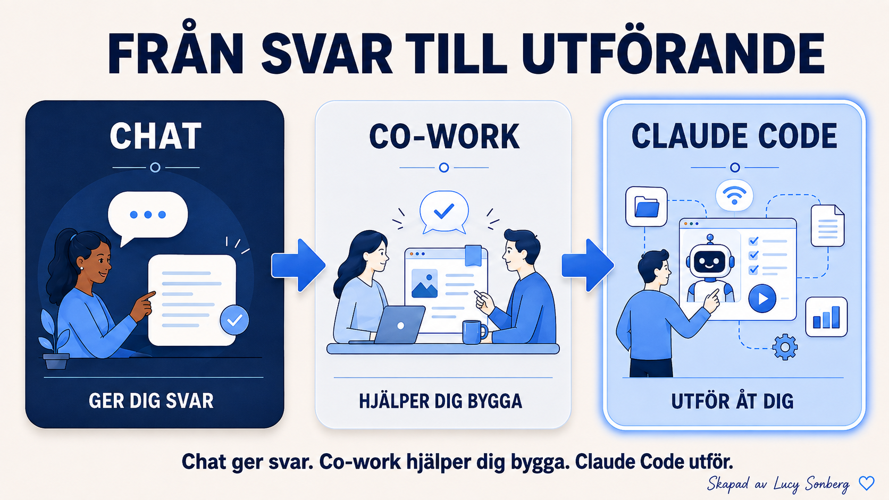

# Från chatt till Claude Code — varför du är här

[← Tillbaka till kursplanen](../KURSPLAN.md)

*Del av kursen [Claude Code på svenska](../README.md) — Börja här.*

Du har antagligen redan chattat med en AI: ställt frågor, fått svar,
kopierat ut texten och gjort resten själv. Något sa åt dig att gå
vidare, även om det inte var självklart varför. Här är anledningen, i
tre nivåer.

## Chatt — den berättar

Du frågar, den svarar. Skriv det här mejlet, förklara den här idén, ge
mig ett kodutdrag. Bra, men den lämnar över ord och stannar där. Du gör
fortfarande jobbet själv efteråt.

## Samarbete — den hjälper dig bygga en sak

Ett steg upp. Claude jobbar med dig i ett och samma fönster, och du ser
en enskild sak ta form: ett dokument, en graf, ett utkast du kan
justera. Den kan till och med nå några av dina verktyg. Bättre, för nu
får du något byggt, inte bara text. Men det är fortfarande en
arbetsbänk — du och Claude formar en sak tillsammans, i en sandlåda.

## Claude Code — den utför arbetet

Det här är språnget, och det är hela anledningen till att du är här.
Du beskriver resultatet, och Claude bygger det på riktigt: riktiga
filer på din dator, riktiga program som körs, en riktig produkt du kan
visa en betalande kund. Inte en beskrivning av en webbsida. Webbsidan.
Du slutar vara den som utför arbetet och blir den som leder det.

Det är hela poängen. Chatt berättar. Samarbete hjälper. Claude Code
utför.

## Varför det känns ovant först

Du är van vid att kopiera svar ur en chattruta. Här slutar du kopiera
och börjar leda istället. Den instinkten som sa åt dig att ta steget
vidare hade rätt. Följ den.

**Nästa:** [Claude Code: appen eller terminalen — vilken ska du välja?](04-appen-eller-terminalen.md)

---

**Skapat av [Lucy Sonberg](https://www.linkedin.com/in/lucysonberg)** · [GitHub](https://github.com/LucyVers)
Licensierat under [CC BY-NC-ND 4.0](../LICENSE) — dela gärna med kredit, hör av dig för kommersiell användning eller institutionell licensiering.
