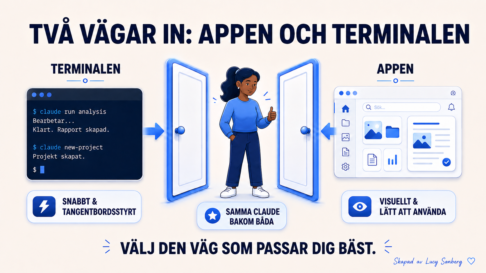

# Claude Code: appen eller terminalen — vilken ska du välja?

[← Tillbaka till kursplanen](../KURSPLAN.md)

*Del av kursen [Claude Code på svenska](../README.md) — Börja här.*

Claude Code går att köra på två sätt, med exakt samma Claude bakom
båda. Ingetdera är fel. De passar bara olika personer.

## Terminalen

Den klassiska textskärmen, och sättet Claude Code ursprungligen
byggdes för. Snabb, tangentbordsdriven, och många erfarna byggare kör
allt härifrån. Den ser kal ut i början, och du behöver den inte för
att komma igång. Nyfiken på att testa den? [Allt du behöver veta om
terminalen](08-allt-om-terminalen.md) tar dig igenom det, helt
frivilligt.

## Skrivbordsappen

Ett vanligt fönster. Du skriver vad du vill ha, ser det arbeta, ser
dina filer och en direktuppdaterad förhandsvisning. Samma motor som
terminalen, fast paketerad i ett bekant gränssnitt.

## Min rekommendation: börja med appen

Inte för att den är bättre, utan för att den är det enklaste sättet
att komma igång på dag ett. Terminalen fungerar precis lika bra och
finns alltid kvar. Vill du hellre göra den till din huvudsakliga väg
in är det ett fullt giltigt sätt att bygga på. Båda leder till exakt
samma resultat i Claude Code.

**Nästa:** [Installera Claude Code](05-installera-claude-code.md)

Claude Code utvecklas snabbt. Det som stämmer idag kan vara förändrat
om några månader. Jag uppdaterar allt eftersom jag hinner och hittar
ny information.

---

**Skapat av [Lucy Sonberg](https://www.linkedin.com/in/lucysonberg)** · [GitHub](https://github.com/LucyVers)
Licensierat under [CC BY-NC-ND 4.0](../LICENSE). Dela gärna med kredit, hör av dig för kommersiell användning eller institutionell licensiering.
