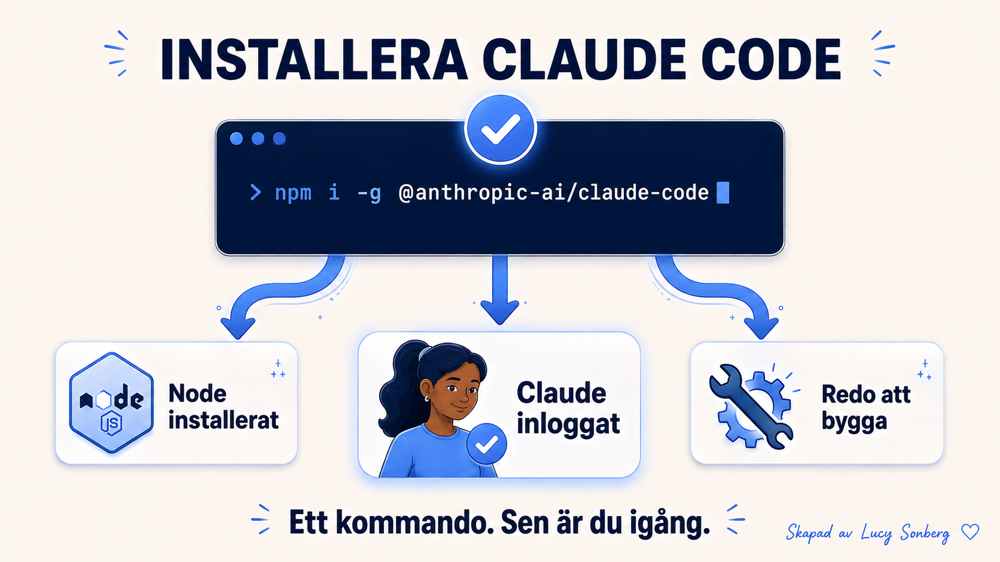

# Installera Claude Code

[← Tillbaka till kursplanen](../KURSPLAN.md)

*Del av kursen [Claude Code på svenska](../README.md) — Börja här.*

Det tar omkring tre minuter att installera Claude Code och vara redo
att skriva din första instruktion, väljer du skrivbordsappen. Väljer
du terminalen istället krävs att Node.js och npm redan finns på din
dator, vilket vi kommer till längre ner.

## Installera skrivbordsappen (rekommenderas)

Skrivbordsappen kör exakt samma motor och samma inställningar som
terminalversionen av Claude Code, bara med fönster och knappar
istället för en svart textskärm. Ingen utvecklarmiljö, inget SDK,
ingen konfigurationsfil. Bara ladda ner, logga in, klart. De flesta
använder aldrig terminalen, och det behöver du inte heller.

1. Öppna [claude.com/download](https://claude.com/download) i din webbläsare.
2. Klicka på "Download Claude Code" och välj macOS eller Windows.
3. Öppna filen du laddade ner. På Mac drar du den till Program (Applications). På Windows kör du installationsprogrammet.
4. Öppna appen. Du hamnar på en inloggningsskärm.
5. Logga in med ditt Claude-konto (samma konto som på claude.ai). Du ser ett rent fönster med en enda inmatningsruta längst ner. Det är allt. Du är igång.

När Claude Code ber om en mapp, skapa en ny tom mapp (kalla den till
exempel `mitt-projekt`) och öppna den. Det blir din hemmabas för allt
du bygger i kursen. Mappen behöver inte innehålla något. Claude Code
vill bara ha en plats att jobba i.

## Terminalalternativet (hoppa över om du är osäker)

Det här kräver att Node.js och npm redan är installerat på din dator.
Har du inte det, använd skrivbordsappen istället.

1. Öppna terminalen och installera Claude Code globalt: `npm i -g @anthropic-ai/claude-code`
2. Starta det genom att skriva `claude` och trycka enter.

Samma motor som skrivbordsappen, inga fönster. Du kan alltid växla dit
senare. Du behöver det inte idag.

## Vanliga nybörjarmisstag

**Att övertänka det.** Kör du appen finns ingen separat "miljösetup"
att förbereda. Ladda ner, logga in, klart.

**Att ge upp vid ett felmeddelande.** Nästan alla installationsfel går
att lösa på någon minut. Läs felmeddelandet, sök på det, eller fråga
Claude själv. Chansen är stor att någon annan stött på exakt samma
fel.

**Att tro att terminalen gör dig till en "riktig" utvecklare.** Det
gör den inte. Appen och terminalen delar samma motor och samma
inställningar. Ingen skillnad i vad du kan bygga. Börja med det du
känner dig mest bekväm med.

## Felsökning — de vanligaste problemen

**"Inloggningen fungerar inte."** Logga ut från claude.ai i
webbläsaren först, försök sedan logga in i appen igen. Token-krockar
löser sig oftast direkt.

**"Appen öppnas men är tom."** Stäng appen helt (Cmd-Q på Mac,
högerklicka → Avsluta på Windows) och öppna den igen. Första
nedladdningen av resurser fastnar ibland.

**"Mac säger att appen inte kan öppnas eftersom Apple inte kan
verifiera den."** Högerklicka på appikonen → Öppna. Första gången
kräver ett uttryckligt godkännande.

**"Git krävs för lokala sessioner."** Du har inte gjort något fel. Git
är ett gratis verktyg som Claude Code använder i bakgrunden för att
spara ögonblicksbilder av ditt arbete. Det är det som driver
ångra-knappen.

På Mac: öppna Terminal-appen, skriv `git --version`, tryck enter.
Datorn visar ett meddelande om att utvecklarverktygen saknas och
erbjuder sig att installera dem. Det är inget fel, bara en
installationsfråga. En separat popup dyker upp och frågar om du vill
installera "command line developer tools" (den gömmer sig ibland
bakom terminalfönstret). Klicka Installera och vänta några minuter.
Dyker ingen popup upp, skriv `xcode-select --install` och tryck enter
för att tvinga fram den.

På Windows: ladda ner Git från [git-scm.com](https://git-scm.com) och
klicka dig igenom installationen med standardinställningarna. Starta
om Claude Code, välj din mapp igen, och `git --version` visar nu ett
versionsnummer.

**Visar Claude Code ett felmeddelande som nämner "bash"?** Installera
inget manuellt. Skriv istället in det här direkt i Claude Code:

> Min Claude Code hittar inte Git Bash. Git är installerat på
> `C:\Program Files\Git`. Lägg till CLAUDE_CODE_GIT_BASH_PATH i min
> användarinställningsfil.

Starta om Claude Code, så är det löst. Sitter du ändå fast, skriv
`claude doctor`. Den talar om exakt vad som saknas.

**Nästa:** [Gränssnittet och arbetsflödet i Claude Code](06-granssnittet-och-arbetsflodet.md)

Claude Code utvecklas snabbt. Det som stämmer idag kan vara förändrat
om några månader. Jag uppdaterar allt eftersom jag hinner och hittar
ny information.

---

**Skapat av [Lucy Sonberg](https://www.linkedin.com/in/lucysonberg)** · [GitHub](https://github.com/LucyVers)
Licensierat under [CC BY-NC-ND 4.0](../LICENSE). Dela gärna med kredit, hör av dig för kommersiell användning eller institutionell licensiering.
