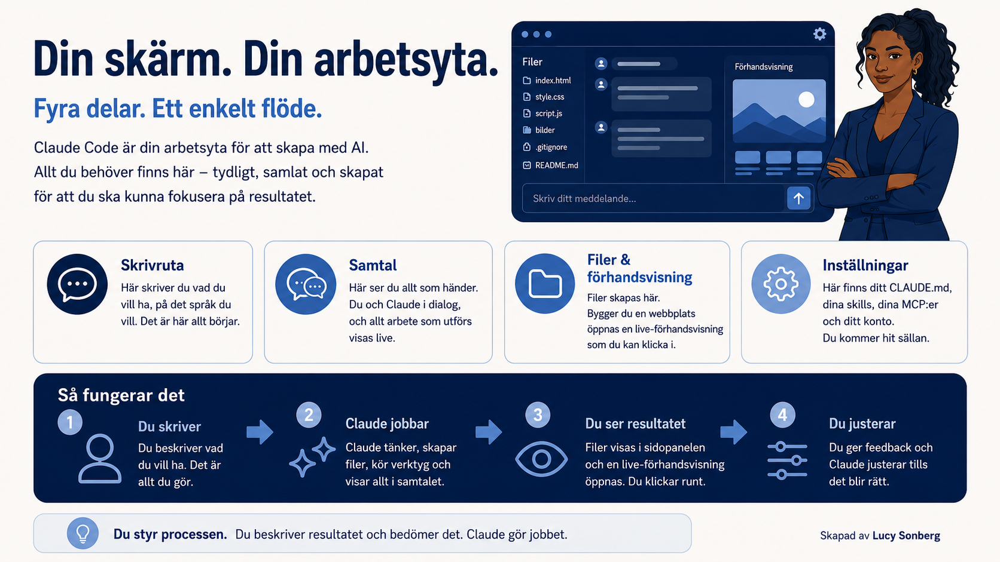

# Gränssnittet och arbetsflödet i Claude Code

[← Tillbaka till kursplanen](../KURSPLAN.md)

*Del av kursen [Claude Code på svenska](../README.md) — Börja här.*

Nu när Claude Code är installerat behöver du en mental modell, ett
enkelt sätt att tänka om det, för hur du faktiskt använder det. Den
här sidan ger dig den, plus en snabb genomgång av varje del av skärmen
du kommer använda.

## En skärm, fyra delar

När du öppnar Claude Code ser du fyra områden. Det är allt du behöver
känna till.

**Inmatningsrutan (längst ner).** Här skriver du vad du vill ha, på
vanlig svenska. Det är det enda stället du någonsin "kommenderar"
appen från.

**Konversationsytan (i mitten).** Allt du sagt och allt Claude svarat,
i en rullande logg. Claudes verktygsanrop, filredigeringar,
terminalkommandon, webbläsaröppningar, syns här medan du tittar på. Du
ser arbetet hända.

**Fil- och förhandsvisningsrutan (i sidled eller helskärm).** Filer
Claude skapar dyker upp här. Bygger du en webbsida öppnas en levande
förhandsvisning här, och du kan klicka runt i den som en riktig
besökare.

**Inställningar (kugghjulet uppe till höger).** Här bor din globala
CLAUDE.md, dina skills, dina MCP:er och ditt konto. Du rör den här ett
par gånger i nästa avsnitt och sedan sällan igen.

## Arbetsflödet du kommer använda om och om igen

Så fort appen är öppen ser varje interaktion med Claude Code likadan
ut.

Du skriver vad du vill ha, med egna ord. Till exempel "bygg mig en
enkel portfoliosida med mina tre senaste projekt".

Claude jobbar. Du ser den tänka, skapa filer och köra kommandon, allt
synligt i konversationsytan medan det händer. Inget sker dolt i
bakgrunden.

Du ser resultatet. Filer dyker upp i sidrutan, en förhandsvisning
öppnas, du klickar runt.

Du reagerar. "Flytta menyn till toppen", "byt typsnittet till något
enklare", "lägg till en kontaktruta", och Claude justerar.

Du beskriver resultat och bedömer vad du får, du skriver inte koden
själv. Det är skillnaden mellan att faktiskt bygga något och att
skjuta upp det ett år till.

## Vanliga nybörjarmisstag

**Att försöka memorera kommandon.** Det finns inga. Du pratar med
Claude med egna ord, på vilket språk du vill.

**Att stänga appen för att "börja om från noll".** Låt bli, då tappar
du kontexten. Säg istället "låt oss starta en ny uppgift", eller
använd knappen för ny session.

**Att titta tyst på medan Claude jobbar.** Prata tillbaka. Går det åt
fel håll, avbryt. Claude är en medarbetare, inte en varuautomat.

**Nästa:** [Prompter som hjälper dig komma igång](07-promptpaket-for-nyborjare.md)

Claude Code utvecklas snabbt. Det som stämmer idag kan vara förändrat
om några månader. Jag uppdaterar allt eftersom jag hinner och hittar
ny information.

---

**Skapat av [Lucy Sonberg](https://www.linkedin.com/in/lucysonberg)** · [GitHub](https://github.com/LucyVers)
Licensierat under [CC BY-NC-ND 4.0](../LICENSE). Dela gärna med kredit, hör av dig för kommersiell användning eller institutionell licensiering.
