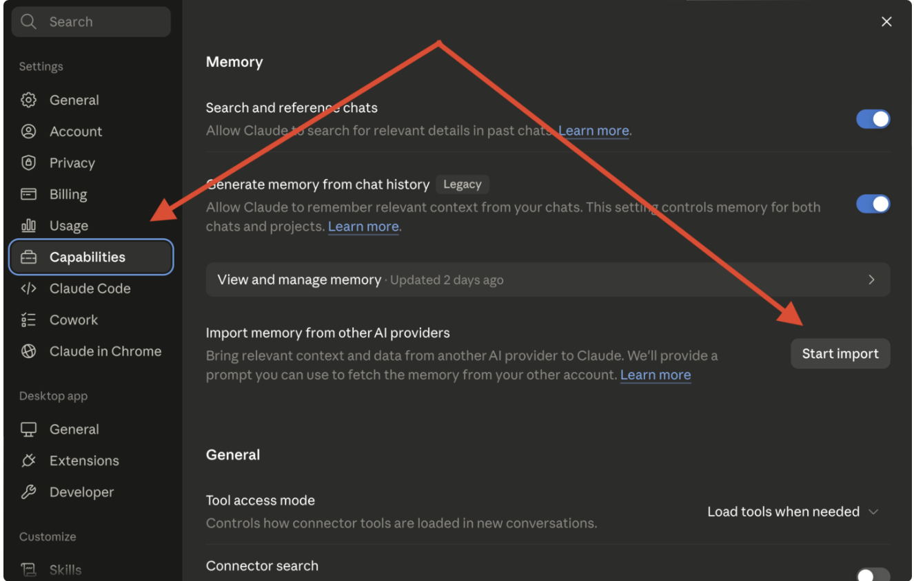
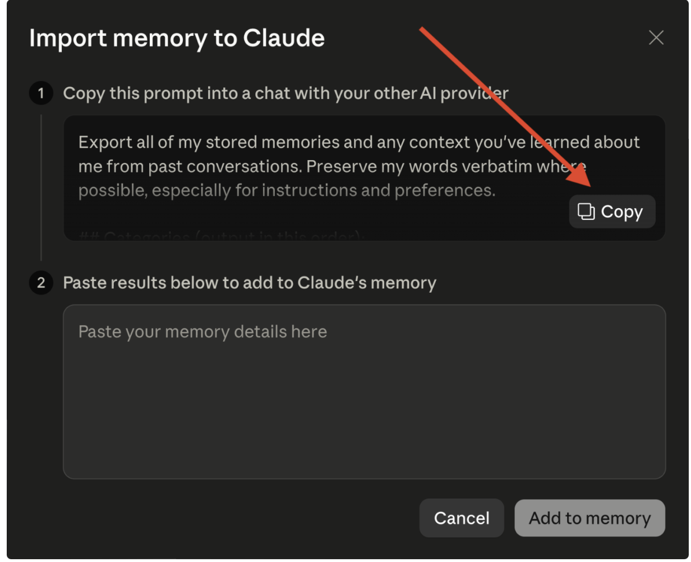
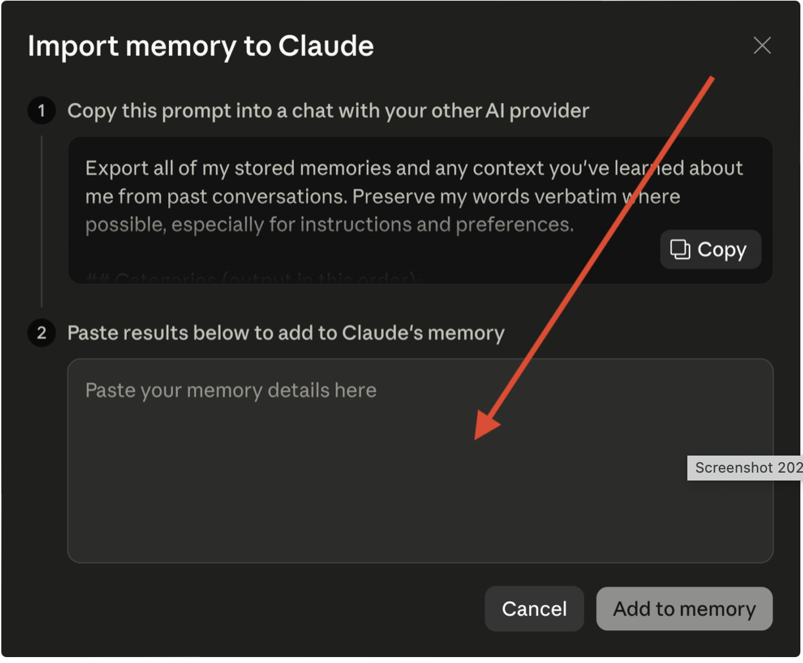

# Importera ditt minne från ChatGPT eller Gemini till Claude Code

[← Tillbaka till kursplanen](../KURSPLAN.md)

*Del av kursen [Claude Code på svenska](../README.md) — Steg 1: Minne.*

Har du redan pratat mycket med ChatGPT eller Gemini och byggt upp en
historik där de lärt känna dig? Du behöver inte börja om från noll.
Claude Code kan importera det du redan delat med en annan AI, så du
slipper förklara samma saker igen.

## Använder du en annan LLM?

Du kan föra över det mesta av vad den redan vet om dig till Claude,
snabbt, och utan att skriva om allt för hand.

### I Claude Desktop-appen:

**1)** Gå till **Inställningar > Funktioner** (Capabilities)

**2)** Gå till **"Importera minne från andra AI-leverantörer"** och klicka på **"Starta import"**

**3)** Kopiera prompten och klistra in den i den LLM du har en historik med

**4)** Klistra in svaret i resultatrutan enligt instruktionerna

**5)** Klicka på **"Lägg till i minnet"**

Nu har Claude Code tillgång till din historik och kan bygga vidare på
det den redan vet om dig.

### Använder du terminalen?

**1)** Starta en ny Claude-session

**2)** Klistra in resultatet från ovan

**3)** Säg till Claude: *"spara dessa minnen om mig"*

Claude Code utvecklas snabbt. Det som stämmer idag kan vara förändrat
om några månader. Jag uppdaterar allt eftersom jag hinner och hittar
ny information.

---

**Skapat av [Lucy Sonberg](https://www.linkedin.com/in/lucysonberg)** · [GitHub](https://github.com/LucyVers)
Licensierat under [CC BY-NC-ND 4.0](../LICENSE). Dela gärna med kredit, hör av dig för kommersiell användning eller institutionell licensiering.
